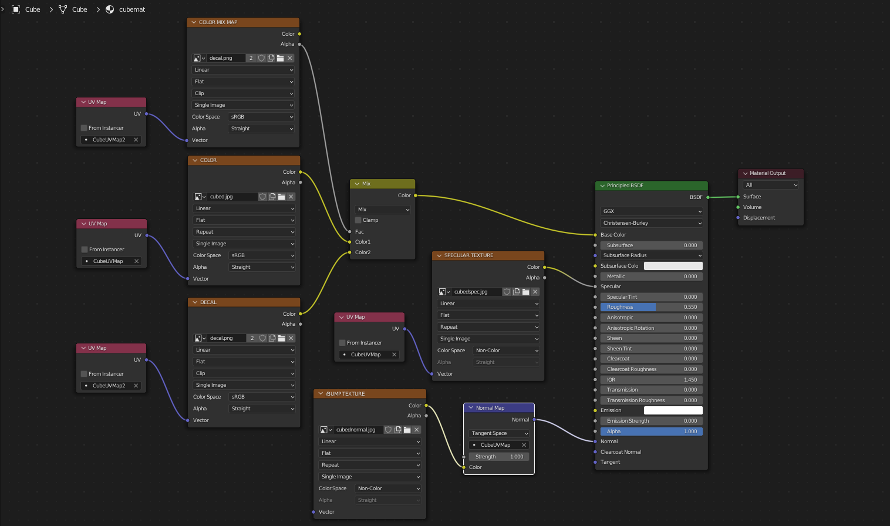
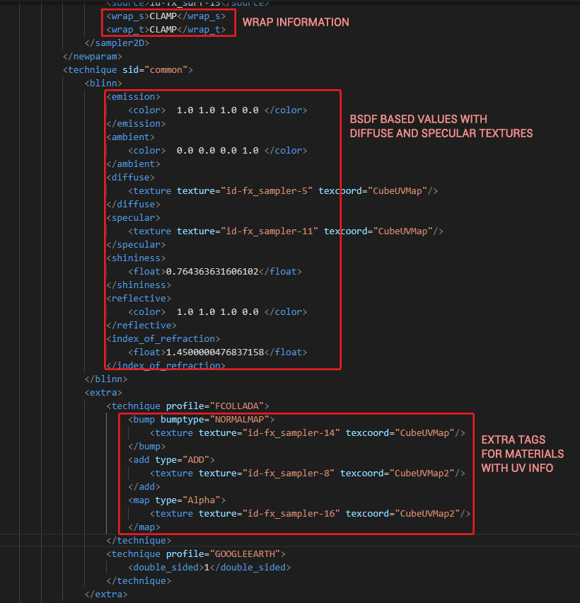

# Nodes "Better" Collada exporter for Blender

This is a fork of Godot Engine's "Better" Collada exporter for Blender. All credits to them.
This Enhanced Collada exporter for [Blender](https://www.blender.org), making the
format viable for importing meshes into game engines such as
[Godot Engine](https://godotengine.org) using a libre format.
The Nodes Better Collada exporter adds extra tags to the format and is probably not usable in the Godot Engine anymore. 
I have been using this code to export my models, due to the non standard collada tags some work 
would be required to use this exporter anywhere else. I don't plan to support this code but I want to share my modifications
in case someone find it somehow useful.

The main goal of the Nodes Better Collada exporter is to provide means to export objects with materials that may contain aside from the diffuse texture, a specular map, a normal bump map and an add or a decal texture with the color mix defined by a "color map" texture. 
This exporter will not export very complex materials and for the goal above to be achieved a series of rules must be followed. 
For the exporter to work: 
- There must be only one BSDF shader per material. If there is more than one, there will be undefined behavior. 
- For color mixing, use multiple textures with the "Color Mix Node". 
- For bump map normal, use the "Normal Map Node". 
- All materials must have a node setup. Basic materials may work even without a BSDF shader, but it is recommended that every material be created with one.

Features of this version, aside from Better Collada Features
- Scan for material nodes and the BSDF shader.
- Identifies bump map textures
- Identifies specular textures and creates a non standard tag for it
- Identifies add textures and creates a non standard tag for it
- Identifies mix textures and creates a non standard tag for it
- Identifies and sets multiple UV's for each of the above

## Installation

1. Copy the `io_scene_dae` directory the location where Blender stores the
   scripts/addons folder on your system (you should see other io_scene_*
   folders there from other addons). Copy the entire dir and not just its
   contents.
2. Go to the Blender settings and enable the "Nodes Better Collada Exporter" plugin.
3. Enjoy full-featured Collada export.

## License

This Nodes Better Collada exporter is distributed under the terms of the GNU General
Public License, version 2 or later. See the [LICENSE.txt](/LICENSE.txt) file
for details.
